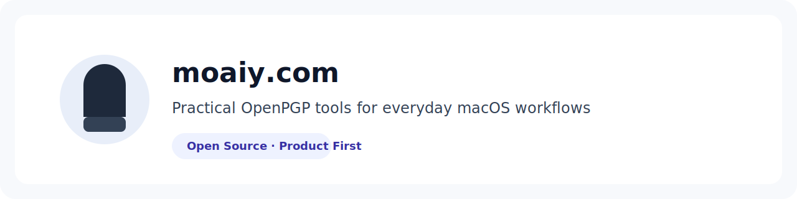

<picture>
  <source media="(prefers-color-scheme: dark)" srcset="./assets/overview-banner-dark.svg">
  <source media="(prefers-color-scheme: light)" srcset="./assets/overview-banner-light.svg">
  
</picture>

# moaiy.com

Open-source tools that make OpenPGP workflows practical and approachable on macOS.

## Quick Links

- Website: [moaiy.com](https://moaiy.com)
- Get Moaiy: [moaiy-com/moaiy](https://github.com/moaiy-com/moaiy)
- Documentation: [Product docs](https://github.com/moaiy-com/moaiy/tree/main/doc)
- Report an Issue: [Issue tracker](https://github.com/moaiy-com/moaiy/issues)

## Featured Projects

| Project | What it is | Start here |
| --- | --- | --- |
| [moaiy](https://github.com/moaiy-com/moaiy) | macOS OpenPGP app for key management, encryption, and decryption | [Repository](https://github.com/moaiy-com/moaiy) |
| [moaiy-com](https://github.com/moaiy-com/moaiy-com) | Official website and user-facing content | [Website source](https://github.com/moaiy-com/moaiy-com) |
| [.github](https://github.com/moaiy-com/.github) | Organization-wide governance, templates, and security defaults | [Org standards](https://github.com/moaiy-com/.github) |

## Security & Trust

- Please report vulnerabilities privately to `security@moaiy.com`.
- Initial acknowledgement target: within 72 hours.
- Triage update target: within 7 business days.
- Full policy: [SECURITY.md](https://github.com/moaiy-com/.github/blob/main/SECURITY.md)

## Community

- Product feedback: [Open an issue](https://github.com/moaiy-com/moaiy/issues)
- Product updates: [Releases](https://github.com/moaiy-com/moaiy/releases)
- Follow updates: [@moaiycom](https://x.com/moaiycom)

  
<strong>Contributing</strong>

We welcome focused contributions that improve product quality and user experience.

- Start here: [CONTRIBUTING.md](https://github.com/moaiy-com/.github/blob/main/CONTRIBUTING.md)
- Keep pull requests small and well-scoped.
- Include testing notes and screenshots for user-facing changes.
- Do not report security issues publicly; use the private channel in [SECURITY.md](https://github.com/moaiy-com/.github/blob/main/SECURITY.md).

## Icon/Logo Attribution

Moai Statue Icons by ProSymbols from [Noun Project](https://thenounproject.com/browse/icons/term/moai-statue/) (CC BY 3.0)
